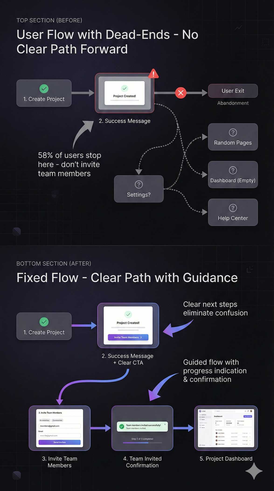

# R-07: Find Hidden User Dead-Ends

# Recipe #7: Find Hidden User Dead-Ends

Category: Wireframing & IA  |  ⏱️ 30-35 min  |  🌶️🌶️🌶️ Advanced

<aside>
🎯

**USE WHEN:**

You're redesigning an application where users frequently get stuck, confused, or abandon tasks mid-flow. Analytics show high exit rates on certain screens, or support tickets reveal common "how do I...?" questions. You need to identify and fix the dead-ends users are hitting.

</aside>

---

<aside>
⚠️

**THE CHALLENGE**

Legacy applications accumulate dead-ends over time - missing back buttons, unclear next steps after completing an action, features that lead nowhere, or critical actions buried where users can't find them. Users hit these walls, get frustrated, and either contact support or abandon the task entirely. Your job is to systematically identify these friction points and redesign the paths to be clear and complete.

</aside>

---

<aside>
🧪

**THE PROMPT BLUEPRINT**

```jsx
Act as a UX Auditor specializing in user flow analysis.

I'm auditing a [Product Type] to find and fix user dead-ends where people get stuck or confused.

[OPTIONAL: Attach screenshots of problem areas, analytics data, or user flow diagrams]

Evidence of dead-ends:
- Analytics: [e.g., "65% exit rate on confirmation screen", "High bounce on settings page"]
- Support tickets: [e.g., "Users ask 'how do I cancel?' daily"]
- User feedback: [e.g., "I completed the form but nothing happened"]

Specific areas of concern:
- [Area 1: e.g., After completing onboarding, users don't know what to do next]
- [Area 2: e.g., Delete button exists but no undo/confirmation]
- [Area 3: e.g., Search returns no results with no alternative suggestions]

User context: [Who encounters these issues and what they're trying to accomplish]

Please analyze and suggest:
1. Complete list of likely dead-ends based on the evidence
2. For each dead-end: what's missing and why users get stuck
3. Specific UX patterns to fix each issue
4. Priority ranking (which dead-ends cause most harm)
5. Prevention strategy for future features

Consider: [Constraints - e.g., Can't remove features, must maintain existing workflows]
```

💡 What to customize:

- [Product Type] = Mobile app, SaaS platform, E-commerce site, Admin dashboard
- [Analytics] = Your actual exit rates, bounce rates, drop-off points
- [Support tickets] = Real common questions or complaints
- [User feedback] = Actual quotes from user research
- [Areas of concern] = Specific screens or flows you suspect are problematic
- Upload screenshots showing problem areas for targeted analysis
</aside>

---

<aside>
✨

**LIVE EXAMPLE**

```jsx
Act as a UX Auditor specializing in user flow analysis.

I'm auditing a Project Collaboration Platform to find and fix user dead-ends where people get stuck or confused.

[User would attach screenshots here]

Evidence of dead-ends:
- Analytics: 58% of users who create a project never invite team members (stuck after project creation)
- Analytics: Settings page has 73% bounce rate - users land there but leave immediately
- Support tickets: "How do I delete a task?" asked 40+ times per month
- Support tickets: "I shared a file but my client says they can't access it" - weekly complaint
- User feedback: "I archived a project and now I can't find it anywhere"
- User feedback: "Clicked 'upgrade' button but nothing loaded - is it broken?"

Specific areas of concern:
- After creating a project, success message appears but no clear "invite team" CTA
- Task deletion requires going to settings → advanced → danger zone (buried 3 levels deep)
- Shared file links generate but no confirmation that sharing worked
- Archived projects disappear from view with no way to access archive
- Upgrade flow redirects to external payment page that looks different, users think it's broken

User context: Small teams (3-10 people) setting up project workspaces. Most are non-technical. They expect smooth, guided experiences. Mobile users represent 40% of traffic.

Please analyze and suggest:
1. Complete list of likely dead-ends based on the evidence
2. For each dead-end: what's missing and why users get stuck
3. Specific UX patterns to fix each issue
4. Priority ranking (which dead-ends cause most harm)
5. Prevention strategy for future features

Consider: Can't remove any features, but can reorganize and add guidance. Must work on both desktop and mobile. Payment flow is handled by third-party (Stripe) so can't fully redesign, only improve handoff.
```

</aside>

---

<aside>
📊

**WHAT TO EXPECT**

The AI will provide:

- Comprehensive dead-end inventory (categorized by severity)
- Root cause analysis for each dead-end
- Specific fix recommendations:
    - Missing CTAs and next steps
    - Confirmation and feedback patterns
    - Rescue flows for error states
    - Breadcrumb trails and navigation
    - Progressive disclosure improvements
- Before/after flow descriptions
- Priority matrix (quick wins vs. high-impact fixes)
- Prevention checklist for new features
- Optional: Annotated user flow diagram showing fixes
</aside>

---

<aside>
👩‍🍳

**CHEF'S TIPS**

✦ Combine data sources: Analytics + support tickets + user feedback = complete picture of where users struggle
✦ Common mistake: Only looking at high-traffic pages - dead-ends often hide in edge cases and secondary flows
✦ Best with: Claude (excellent at analyzing complex flows and root causes), ChatGPT o1 (for systematic audits)
✦ Remix it: "Now audit the mobile experience specifically - where do touch interactions create new dead-ends?"
✦ Pro move: Ask "Create a dead-end prevention checklist I can use for every new feature we ship"

</aside>

---

<aside>
🎯

**FOLLOW-UP PROMPTS**

- "For the top 3 dead-ends, write the micro-copy for success messages and next-step CTAs"
- "Design empty states for when users hit these dead-ends (no search results, no archived projects, etc.)"
- "Create an error prevention strategy: what warnings should we show before users hit these walls?"
- "Map the complete 'undo/recover' flow for destructive actions like delete and archive"
</aside>

---

<aside>
💎

**EXAMPLE OUTPUT**



</aside>

---

<aside>
🔗

**RELATED RECIPES**

→ Recipe #04: [Design Multi-Step Flows](R-04%20Design%20Multi-Step%20Flows%202d667ccc6bef806f9f3be9cdaefa9a9e.md)
→ Recipe #08: [Create Clear Path-Finding](R-08%20Create%20Clear%20Path%20Finding%202d667ccc6bef80f7a748e543ab0cfc40.md)

</aside>