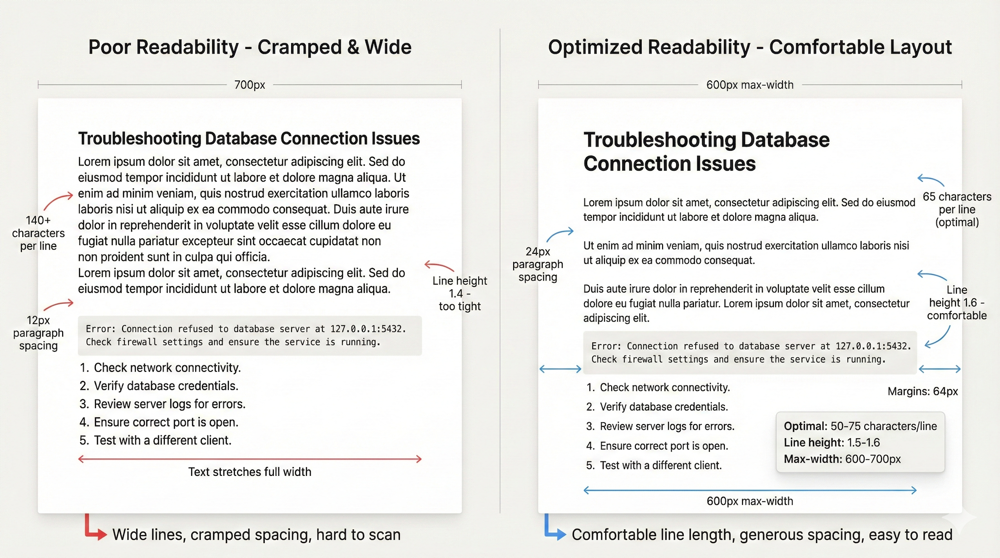

# R-24: Fix Hard-to-Read Text

# Recipe #24: Fix Hard-to-Read Text

Category: UI & Visuals  |  ⏱️ 20-25 min  |  🌶️ Basic

<aside>
🎯

**USE WHEN:**

You're redesigning content-heavy interfaces where users complain text is hard to read - lines are too long, text is too small, spacing is cramped, or backgrounds interfere with readability. Users struggle through documentation, articles, or form instructions.

</aside>

---

<aside>
⚠️

**THE CHALLENGE**

Readable text requires more than just choosing a good font. Many applications have paragraphs stretching 1200+ pixels across screens (forcing eye strain), tight line spacing that makes text blur together, insufficient contrast, or distracting backgrounds. What's readable on a designer's 27" monitor becomes unreadable on a laptop or mobile device. Users abandon long-form content, miss critical instructions, or struggle with eyestrain. You need to optimize every aspect of text presentation for comfortable extended reading.

</aside>

---

<aside>
📊

**WHAT TO EXPECT**

The AI will provide optimal line length recommendations (45-75 characters per line with max-width containers at 600-700px), line height system specifications for different text types (body text at 1.5-1.6, headings at 1.2-1.3, code blocks at 1.6-1.8), paragraph rhythm and spacing guidelines (space between paragraphs at 1.5-2× line height, specific spacing before and after headings), text and background color optimization for contrast and reduced eye strain, font size adjustments for different content types and contexts (minimum 16px body text with zoom support to 200%), layout improvements including margins and column widths, reading aids like clear heading hierarchy and visual section breaks, and mobile optimization maintaining readability on smaller screens. Optionally includes annotated layouts showing before and after improvements.

</aside>

---

<aside>
🧪

**THE PROMPT BLUEPRINT**

```jsx
Act as a Typography and Readability Specialist focusing on text legibility and reading comfort.

I'm improving readability for [Content Type] that users currently find hard to read.

[OPTIONAL: Attach screenshots showing current text layout]

Current text characteristics:
- Font: [e.g., Inter 16px, Georgia 18px]
- Line length: [e.g., Full width containers, 1200px paragraphs, 40 characters mobile]
- Line height: [e.g., 1.4, 1.6, varies by section]
- Paragraph spacing: [e.g., 16px, 24px, inconsistent]
- Background: [e.g., White, light gray, colored backgrounds]
- Reading context: [e.g., Long documentation, short FAQs, form labels]

Current readability problems:
- [Problem 1: e.g., Paragraphs stretch full width - 150+ characters per line]
- [Problem 2: e.g., Line height too tight at 1.3 - text feels cramped]
- [Problem 3: e.g., Text on colored backgrounds reduces contrast]
- [Problem 4: e.g., No paragraph breaks - walls of text]
- [Problem 5: e.g., All-caps headings hard to scan]

User context: [Who reads this, for how long, under what conditions]

Please provide:
1. Optimal line length (characters per line)
2. Line height recommendations
3. Paragraph spacing and rhythm
4. Text color and background optimization
5. Font size adjustments for different content
6. Layout improvements (margins, max-width)
7. Reading aids (headings, lists, whitespace)
8. Mobile readability optimization

Consider: [Constraints - e.g., Must work on narrow mobile screens, different reading contexts, accessibility standards, multilingual content]
```

💡 What to customize:

- [Content Type] = Documentation, Blog articles, Help content, Form instructions, Legal text, Email templates
- [Font] = Current typeface and size
- [Line length] = Current paragraph width
- [Problems 1-5] = Specific readability issues
- Upload screenshots showing current text layout and problem areas
</aside>

---

<aside>
✨

**LIVE EXAMPLE**

```jsx
Act as a Typography and Readability Specialist focusing on text legibility and reading comfort.

I'm improving readability for Technical Documentation and Help Articles that users currently find exhausting to read.

[User would attach screenshots here]

Current text characteristics:
- Font: Inter 15px (body text), Inter 14px (sidebar content)
- Line length: Full-width containers - main content stretches 1100px on desktop (140-160 characters per line!), mobile squeezes to 320px (35-40 characters)
- Line height: 1.4 for all text (headings and body same)
- Paragraph spacing: 12px between paragraphs (too tight)
- Background: White main content, light gray #F5F5F5 sidebars, occasional blue info boxes with white text
- Reading context: Technical troubleshooting guides averaging 1500-3000 words, step-by-step tutorials, API documentation with code samples

Current readability problems:
- Paragraphs stretch edge-to-edge on wide screens - 160 characters per line forces eye fatigue (optimal is 45-75)
- Tight line height (1.4) makes dense technical content blur together during long reading sessions
- No breathing room - paragraphs separated by only 12px, sections cramped
- Sidebar content (14px) too small for secondary information that's actually important
- Code blocks use same line height as body text - code needs different spacing
- Long numbered lists (15+ steps) with no visual breaks - users lose their place
- Headings use same line height as body (1.4) - too much space above/below headings
- All-caps "WARNING" and "NOTE" labels hard to scan quickly
- Blue info boxes (#2196F3 background, white text) fail contrast in bright offices

User context: Developers and IT professionals reading documentation to solve problems - sessions last 10-30 minutes. Often reference documentation on second monitor while coding. Users aged 25-55, some wearing glasses/contacts. Read in various lighting (bright offices, dim rooms). High cognitive load - complex technical concepts require focus. 35% read on tablets during meetings.

Please provide:
1. Optimal line length (characters per line)
2. Line height recommendations
3. Paragraph spacing and rhythm
4. Text color and background optimization
5. Font size adjustments for different content
6. Layout improvements (margins, max-width)
7. Reading aids (headings, lists, whitespace)
8. Mobile readability optimization

Consider: Technical accuracy critical - can't summarize or shorten content. Code samples must remain monospace and preserve formatting. Multi-step instructions common (20+ steps). Must work for users who zoom text 125-150%. Need to support syntax highlighting in code blocks. Some content has tables with 6-8 columns.
```

</aside>

<aside>
👩‍🍳

**CHEF'S TIPS**

✦ Measure in characters, not pixels: 50-60 characters per line is optimal, regardless of font size
✦ Common mistake: Making text bigger when the real problem is line length - 20px text at 150 characters is worse than 16px at 60 characters
✦ Best with: Claude (excellent at readability analysis), ChatGPT (good for layout recommendations)
✦ Remix it: "Design the reading mode - how should layout change when user enables focus/reader mode?"
✦ Pro move: Ask "Create the readability scoring system - how to programmatically measure text readability?"

</aside>

---

<aside>
🎯

**FOLLOW-UP PROMPTS**

- "Design the dark mode reading experience - how does readability change with white text on dark backgrounds?"
- "Create the dyslexia-friendly mode - what font, spacing, and layout changes help dyslexic readers?"
- "How should tables and data displays handle readability when they need wide layouts?"
- "Generate the print stylesheet - optimize this for paper/PDF reading"
</aside>

---

<aside>
💎

**EXAMPLE OUTPUT**



</aside>

---

<aside>
🔗

**RELATED RECIPES**

→ Recipe #22: [Check Your Color Contrast](R-22%20Check%20Your%20Color%20Contrast%202d667ccc6bef8030822cc761e4959070.md)
→ Recipe #58: [Create Perfect Font Scales](R-58%20Build%20Typography%20Systems%202d767ccc6bef80a697f8df65451a5b47.md)
→ Recipe #34: [Polish Your Input Fields](R-34%20Polish%20Your%20Input%20Fields%202d767ccc6bef806aa554c4a058472a9b.md)

</aside>