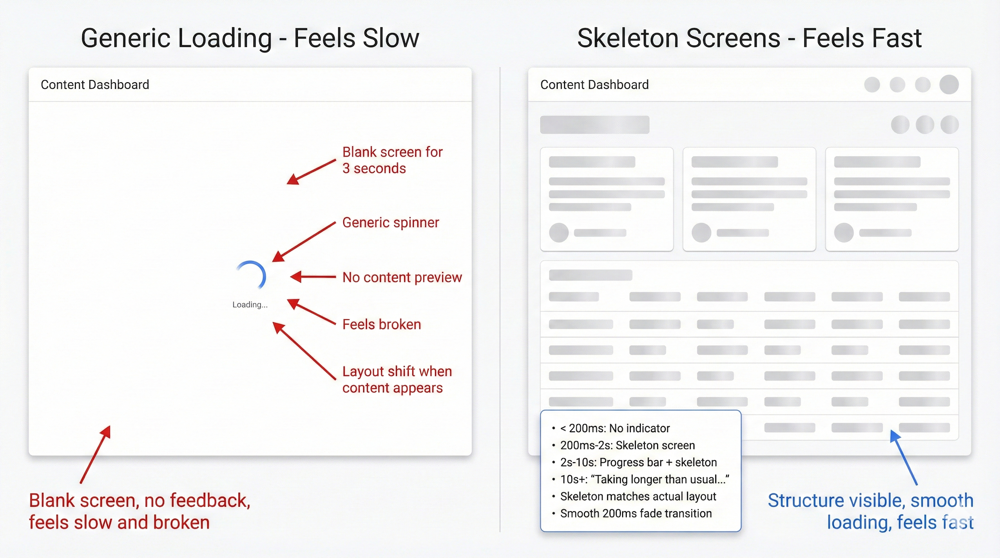

# R-31: Polish Your Loading States

# Recipe #31: Polish Your Loading States

Category: UI & Visuals  |  ⏱️ 20-25 min  |  🌶️🌶️ Intermediate

<aside>
🎯

**USE WHEN:**

You're redesigning loading experiences that feel slow, unresponsive, or frustrating - generic spinners appear instantly, content pops in abruptly, or users stare at blank screens wondering if the app is broken. The interface needs smoother, more informative loading feedback.

</aside>

---

<aside>
⚠️

**THE CHALLENGE**

Many applications handle loading poorly - showing generic spinners immediately (causing layout jank), displaying blank screens for 3+ seconds with no feedback, or having content pop in abruptly without transitions. Users don't know if the app is working, how long to wait, or if they should refresh. Loading spinners appear for fast operations (creating visual noise) and disappear for slow ones (leaving users confused). You need a sophisticated loading strategy with skeleton screens, optimistic UI, progressive loading, and clear feedback that makes waiting feel faster and builds confidence.

</aside>

---

<aside>
📊

**WHAT TO EXPECT**

The AI will provide a comprehensive loading strategy framework with timing thresholds (no indicator for <100ms, delayed spinner for 100-500ms, skeleton screens for 500ms-2s, progress indicators for longer waits), skeleton screen design matching actual content layouts with pulse animations and smooth fade transitions, progressive loading approach prioritizing critical above-fold content with lazy loading and streaming data, optimistic UI patterns for immediate feedback with background syncing and error rollback strategies, progress indication systems for both determinate operations (file uploads with percentages and time estimates) and indeterminate operations (spinners with messages), loading delay thresholds to prevent visual flicker, transition and animation timing specifications for smooth content appearance, and error handling with timeouts, retry logic, and offline detection. Optionally includes loading state flowcharts and visual examples.

</aside>

---

<aside>
🧪

**THE PROMPT BLUEPRINT**

```jsx
Act as an Interaction Designer specializing in loading states, perceived performance, and skeleton screens.

I'm designing loading experiences for a [Product Type] to make waiting feel faster and build user confidence.

[OPTIONAL: Attach videos showing current loading behavior or screenshots of loading states]

Loading contexts:
- Common loading scenarios: [e.g., Page load, Infinite scroll, Form submission, Search results, File upload, Data refresh]
- Typical load times: [e.g., <100ms instant, 100ms-1s fast, 1-3s moderate, 3-10s slow, 10s+ very slow]
- Network conditions: [e.g., Fast wifi, Mobile 4G, Slow 3G, Offline]
- Content types: [e.g., Text, Images, Videos, Data tables, Charts]

Current loading problems:
- [Problem 1: e.g., Generic spinner appears instantly - even for 200ms loads, creating visual noise]
- [Problem 2: e.g., Blank white screen for 3 seconds - users think app is broken]
- [Problem 3: e.g., No progress indication - users don't know how long to wait]
- [Problem 4: e.g., Content pops in abruptly - jarring layout shifts]
- [Problem 5: e.g., Same loading treatment for 500ms and 5-second loads]

User context: [Platform, typical connection speeds, user patience level, task importance]

Please provide:
1. Loading strategy framework (when to show what type of loading indicator)
2. Skeleton screen design (content placeholders)
3. Progressive loading approach (load critical content first)
4. Optimistic UI patterns (show result immediately, sync in background)
5. Progress indication (determinate vs. indeterminate)
6. Loading delay thresholds (when to show indicators)
7. Transition and animation timing
8. Error and timeout handling

Consider: [Constraints - e.g., Variable network speeds, must work offline, different content types load at different speeds, accessibility for screen readers]
```

💡 What to customize:

- [Product Type] = News site, Dashboard, E-commerce, Social feed, File manager, Data app
- [Loading scenarios] = When loading happens in your app
- [Load times] = Typical duration for different operations
- [Content types] = What's being loaded
- [Problems 1-5] = Current loading experience issues
- Upload videos or recordings showing current loading behavior
</aside>

---

<aside>
✨

**LIVE EXAMPLE**

```jsx
Act as an Interaction Designer specializing in loading states, perceived performance, and skeleton screens.

I'm designing loading experiences for a Content Dashboard and Feed Application to make waiting feel faster and build user confidence.

[User would attach loading behavior videos here]

Loading contexts:
- Common loading scenarios:
  - Initial page load (dashboard with 6 widget cards)
  - Infinite scroll (loading more feed items)
  - Search results (querying database)
  - Refreshing data (pull-to-refresh on mobile)
  - Uploading files (with progress)
  - Filtering/sorting large datasets
  - Opening detail views (modal with async data)
- Typical load times:
  - Fast (< 500ms): Single card refresh, simple searches
  - Moderate (500ms-2s): Initial page load, complex queries
  - Slow (2-5s): Large dataset filters, image uploads
  - Very slow (5-15s): Video processing, batch operations
- Network conditions:
  - Office wifi (fast): 90% of desktop users
  - Mobile 4G (variable): 60% of mobile users
  - Slow 3G (slow): 10% of users in poor coverage
  - Offline: Must handle gracefully
- Content types:
  - Text and data (loads fast)
  - Thumbnails and icons (moderate)
  - Full-size images (slow)
  - Charts and visualizations (moderate, data-dependent)

Current loading problems:
- Generic spinner appears immediately for all loads - even 200ms card refreshes show spinner briefly, creating visual flicker and noise
- Initial page load shows blank white screen for 2-3 seconds with just a centered spinner - users think app crashed or is frozen
- No progress indication for file uploads - users upload 50MB video and have no idea if it's 10% or 90% complete
- Feed items pop in abruptly when scrolling - causes layout shift, content jumps around, hard to read
- Same loading spinner for 500ms search and 5-second data export - no sense of expected wait time
- Refresh button shows no feedback - users click multiple times thinking it didn't work
- Modal dialogs open instantly but then show spinner inside - jarring to see empty modal then loading state
- When network is slow, entire interface freezes - no indication that anything is happening

User context: Knowledge workers checking dashboard 10-20 times per day. Mobile users on commutes with variable connectivity. File uploads critical for workflows but often large (20-100MB). Users are impatient - if page takes > 3 seconds with no feedback, they refresh or give up. Accessibility important - screen reader users need loading announcements.

Please provide:
1. Loading strategy framework (when to show what type of loading indicator)
2. Skeleton screen design (content placeholders)
3. Progressive loading approach (load critical content first)
4. Optimistic UI patterns (show result immediately, sync in background)
5. Progress indication (determinate vs. indeterminate)
6. Loading delay thresholds (when to show indicators)
7. Transition and animation timing
8. Error and timeout handling

Consider: Must handle variable network speeds gracefully. Mobile users on 3G need different experience than desktop on wifi. Large files need clear progress. Skeleton screens must match actual content layout (avoid layout shift). Screen readers need loading state announcements. Some operations can be optimistic (like/favorite), others can't (delete).
```

</aside>

<aside>
👩‍🍳

**CHEF'S TIPS**

✦ Delay showing spinners: Don't show loading indicator if operation completes in < 200ms - prevents flicker
✦ Common mistake: Same loading treatment for all durations - 500ms needs skeleton, 5s needs progress bar
✦ Best with: Claude (excellent at timing strategies and edge cases), ChatGPT (good for skeleton screen patterns)
✦ Remix it: "Design the offline-first experience - how to handle loading when network is unavailable"
✦ Pro move: Ask "Create the loading performance budget - maximum wait times before showing fallbacks"

</aside>

---

<aside>
🎯

**FOLLOW-UP PROMPTS**

- "Design the skeleton screen system - create placeholders for all common content patterns"
- "How should infinite scroll loading work - when to trigger, how to indicate more content loading?"
- "Create the optimistic UI decision tree - which actions can be optimistic, which need confirmation?"
- "Design the slow connection experience - what happens when load takes 30+ seconds on 3G?"
</aside>

---

<aside>
💎

**EXAMPLE OUTPUT**



</aside>

---

<aside>
🔗

**RELATED RECIPES**

→ Recipe #27: [Design Smooth Interactions](R-27%20Design%20Smooth%20Interactions%202d767ccc6bef80979ab0f6fc70dc611e.md)
→ Recipe #30: [Design Empty States](R-30%20Design%20Empty%20States%202d767ccc6bef80bf8926fcdc9c1d4e5a.md)

</aside>