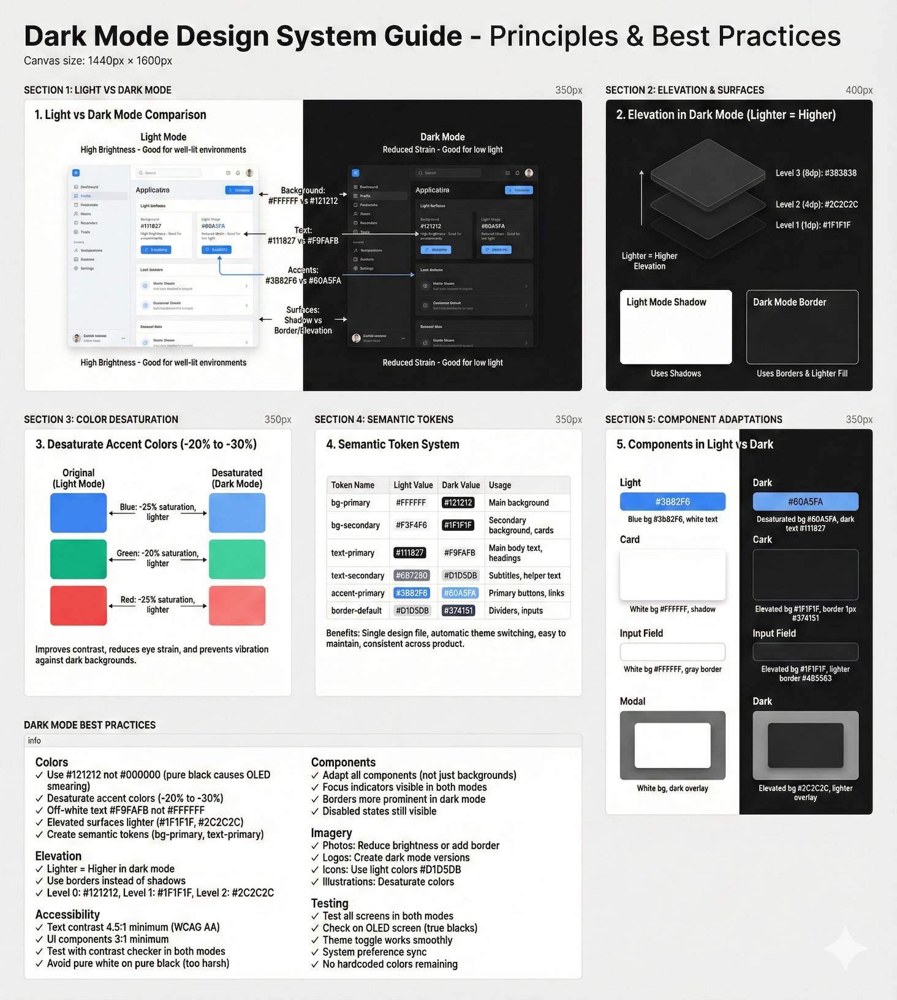

# R-66: Design for Dark Mode

# Recipe #66: Design for Dark Mode

Category: Bonus — Theming  |  ⏱️ 30-40 min  |  🌶️🌶️🌶️ Advanced

<aside>
🎯

**USE WHEN:**

You're adding dark mode to your product or designing components that work in both light and dark themes - converting colors from light to dark, creating semantic color tokens, handling elevation and shadows, managing imagery and illustrations, or ensuring accessibility in both modes. Your current dark mode looks washed out, has poor contrast, doesn't feel intentional, or components break when switching themes.

</aside>

---

<aside>
⚠️

**THE CHALLENGE**

Many designers implement dark mode poorly - simply inverting colors (resulting in harsh whites on pure black, eye strain), using pure black backgrounds (#000000 causes smearing on OLED, too high contrast), inconsistent color conversions (some screens dark mode, others don't), broken elevation (shadows invisible on dark backgrounds), poor imagery handling (photos look wrong, illustrations don't adapt), insufficient contrast (text too dim, fails WCAG), or no semantic tokens (hardcoded colors, can't theme). Teams create dark modes that feel like afterthoughts, cause accessibility issues, look inconsistent across the product, or require maintaining two separate design files. You need systematic dark mode design - semantic color tokens (variables that work in both themes), elevation-based surfaces (lighter = higher in dark mode), proper color conversions (desaturate colors, adjust contrast), dark mode specific components (different shadows, borders), image handling (separate dark assets, photo treatments), and accessibility testing (contrast in both modes).

</aside>

---

<aside>
📊

**WHAT TO EXPECT**

The AI will provide color conversion strategies (proper dark backgrounds, desaturated accent colors, not simple inversion), semantic color token systems (bg-primary, text-primary that work in both themes), elevation and depth techniques (lighter surfaces = higher in dark mode, borders instead of shadows), dark mode specific adjustments (focus rings, disabled states, input fields), imagery handling (separate dark assets, photo treatments, icon adaptations), accessibility guidelines (WCAG contrast in dark mode), component adaptations for buttons, cards, modals, forms, tables, and charts, plus implementation guidance for theme toggles and testing. You'll get a systematic approach to create professional, accessible dark mode that feels intentional.

</aside>

---

<aside>
🧪

**THE PROMPT BLUEPRINT**

```jsx
Act as a Dark Mode Design Specialist focusing on color systems, semantic tokens, elevation strategies, and creating accessible themes.

I'm designing dark mode for [Product/Component Library] to support [User Preferences] by converting [Light Mode Design] to dark mode, ensuring [Key Requirements] work in both themes.

[OPTIONAL: Attach current light mode design or dark mode with issues]

Dark mode requirements:
- Product type: [e.g., Mobile app, Web app, Dashboard, Marketing site]
- User needs: [e.g., Reduce eye strain, Battery saving (OLED), User preference toggle, System theme matching]
- Current state: [e.g., Light mode only, Dark mode exists but broken, Need to add dark mode]
- Color system: [e.g., Hardcoded colors, Some variables, Full design token system]
- Components: [e.g., Buttons, Cards, Modals, Forms, Data tables, Charts, Navigation]

Current dark mode problems:
- [Problem 1: e.g., Simple color inversion - harsh white on pure black, eye strain, looks bad]
- [Problem 2: e.g., No elevation system - cards, modals, menus all same gray, no depth]
- [Problem 3: e.g., Broken shadows - shadows invisible on dark backgrounds, can't see elevation]
- [Problem 4: e.g., Inconsistent colors - some components adapted, others still light mode]
- [Problem 5: e.g., Poor contrast - text too dim #666 on #333 background, fails WCAG]

Team context: [Dark mode priority, design system maturity, platform (iOS/Android/Web), timeline]

Please provide:
1. Color conversion strategies (light to dark, not simple inversion, desaturation, contrast)
2. Semantic color tokens (variables that work both themes, bg-primary, text-primary)
3. Elevation and depth (surface colors, lighter = higher in dark mode, shadows to highlights)
4. Dark mode specific adjustments (borders, shadows, focus rings, different treatments)
5. Imagery and illustrations (separate dark assets, photo handling, icon treatments)
6. Accessibility in dark mode (contrast ratios, WCAG compliance, readability)
7. Component adaptations (buttons, cards, modals, forms, tables, charts in dark mode)
8. Implementation and testing (theme toggle, system preference, testing both modes)

Consider: [Constraints - e.g., Must support both modes, OLED optimization, System theme sync, Limited design resources]
```

💡 What to customize:

- [Product/Component Library] = What you're adding dark mode to
- [User Preferences] = Why users need dark mode
- [Light Mode Design] = Current light mode design
- [Key Requirements] = What must work in dark mode
- [Product type] = Mobile, web, dashboard
- [Problems 1-5] = Current dark mode issues
- Attach light mode design or broken dark mode
</aside>

---

<aside>
✨

**LIVE EXAMPLE**

```jsx
Act as a Dark Mode Design Specialist focusing on color systems, semantic tokens, elevation strategies, and creating accessible themes.

I'm designing dark mode for a SaaS Project Management Dashboard (web app, desktop-focused) to support user preference for reduced eye strain during long work sessions, OLED battery saving on laptops, and matching system dark mode by converting our light mode design (white backgrounds, blue primary, gray surfaces) to dark mode, ensuring buttons, cards, modals, forms, data tables, and charts work seamlessly in both themes.

[User would attach current light mode design - white backgrounds, blue accents, gray cards, shadows for elevation]

Dark mode requirements:
- Product type: Web app dashboard (desktop-focused, some mobile usage)
- User needs:
  - Reduce eye strain (users work 8+ hours, bright white screens cause fatigue)
  - Battery saving (OLED laptops benefit from dark backgrounds)
  - User preference (50% of users prefer dark mode for focused work)
  - System theme sync (match macOS/Windows dark mode setting)
  - Late night work (many users work evenings, dark mode less disruptive)
- Current state:
  - Light mode only (white #FFFFFF backgrounds, blue #3B82F6 primary)
  - No dark mode exists (high user demand, top feature request)
  - Colors hardcoded (not using design tokens, will need refactor)
- Color system:
  - Currently: Hardcoded hex values (#FFFFFF, #F3F4F6, #3B82F6)
  - Need: Semantic tokens (bg-primary, bg-secondary, text-primary work both modes)
  - Palette: Blue primary, Gray neutrals, Green success, Red error, Yellow warning
- Components:
  - Buttons (Primary, Secondary, Tertiary, Danger)
  - Cards (project cards, task cards, dashboard widgets)
  - Modals (confirmation dialogs, forms in modals)
  - Forms (inputs, dropdowns, checkboxes, toggles)
  - Data tables (sortable, selectable rows, pagination)
  - Charts (bar charts, line graphs, pie charts with colors)
  - Navigation (sidebar nav, header nav, breadcrumbs)

Current dark mode problems (from initial prototype attempt):
- Simple color inversion - Designer inverted colors (white → black, black → white), result: harsh pure white #FFFFFF text on pure black #000000 background, extreme contrast causes eye strain, text edges "smear" on OLED screens, looks amateurish not professional, too stark not subtle
- No elevation system - All surfaces same dark gray #1F1F1F (cards, modals, page background all identical), can't distinguish layers, cards don't "pop" from background, modals don't feel elevated, everything flat and monotonous, users report "can't tell what's clickable"
- Broken shadows - Light mode uses shadows for depth (cards have box-shadow: 0 2px 8px rgba(0,0,0,0.1)), dark mode kept same shadows, shadows invisible on dark backgrounds (black shadow on dark gray = can't see), elevation cues lost, interface feels flat
- Inconsistent color conversions - Blue primary #3B82F6 kept same in dark mode (too saturated, vibrates against dark background), Green success #10B981 too bright (eye-searing on dark), Yellow warning #F59E0B overwhelming, colors need desaturation for dark mode not same hex values
- Poor text contrast - Body text gray #9CA3AF on dark background #1F1F1F = 3.8:1 contrast ratio (fails WCAG AA 4.5:1), secondary text #6B7280 even worse 2.5:1 (very hard to read), users complain "text too dim, hard to read", especially bad for long-form reading
- Imagery doesn't adapt - Product screenshots (light mode apps) look wrong in dark interface, photos too bright and jarring, logos designed for light backgrounds invisible on dark (white logos on white cards were fine, white on dark cards invisible), icons all black (invisible on dark backgrounds)
- Hardcoded colors everywhere - 150+ hardcoded hex values in Figma, no variables/tokens, converting to dark mode requires changing every hex value manually, impossible to maintain two separate files, need semantic token system

Team context:
- Priority: High (top user request, 50% of users want dark mode)
- Design system: Minimal (colors hardcoded, need to build token system)
- Platform: Web app (desktop Chrome, Firefox, Safari, some mobile)
- Timeline: 2 months (refactor to tokens + design dark mode + implement)
- Resources: 2 designers, 3 frontend developers, can invest time in token system
- Testing: Can test on macOS (built-in dark mode), Windows 11 (dark mode), OLED screens
- User research: Surveyed users, 50% prefer dark mode, 30% use system preference

Please provide:
1. Color conversion strategies (light to dark, not simple inversion, desaturation, contrast)
2. Semantic color tokens (variables that work both themes, bg-primary, text-primary)
3. Elevation and depth (surface colors, lighter = higher in dark mode, shadows to highlights)
4. Dark mode specific adjustments (borders, shadows, focus rings, different treatments)
5. Imagery and illustrations (separate dark assets, photo handling, icon treatments)
6. Accessibility in dark mode (contrast ratios, WCAG compliance, readability)
7. Component adaptations (buttons, cards, modals, forms, tables, charts in dark mode)
8. Implementation and testing (theme toggle, system preference, testing both modes)

Consider: Web app (desktop-focused). User preference + system sync. OLED optimization (true blacks vs dark gray debate). Must maintain WCAG AA contrast. Need semantic token system (refactor from hardcoded). 150+ color values to systematize. Blue/gray/green/red/yellow palette. Cards, modals, tables, charts all need dark versions.
```

</aside>

---

<aside>
👩‍🍳

**CHEF'S TIPS**

✦ Never pure black: Use #121212 instead of #000000 - reduces OLED smearing and eye strain
✦ Common mistake: Keeping same saturated colors in dark mode - always desaturate blues, greens, reds by 20-30%
✦ Best with: Claude (excellent at color token systems, systematic conversions), ChatGPT (good for color calculations)
✦ Remix it: "Convert this light mode design to dark mode - desaturate colors, elevation surfaces, semantic tokens, WCAG contrast"
✦ Pro move: Ask "Audit my dark mode for accessibility - check all text contrast, surface elevation, color vibration issues"

</aside>

---

<aside>
🎯

**FOLLOW-UP PROMPTS**

- "Create dark mode color palette - convert light mode white/blue/gray to dark mode with elevation levels"
- "Design semantic color tokens - bg-primary, text-primary, border-primary that work in light and dark modes"
- "Convert this button component to dark mode - adjust colors, borders, focus states, maintain accessibility"
- "Test dark mode contrast - check all text and UI components meet WCAG AA in dark mode"
</aside>

---

<aside>
💎

**EXAMPLE OUTPUT**



</aside>

---

<aside>
🔗

**RELATED RECIPES**

→ Recipe #64: [Design Accessible Components](R-64%20Design%20Accessible%20Components%20d8c67ccc6bef83ed9c3201d848757c88.md)
→ Recipe #21: [Turn Brand Into UI Styles](R-21%20Turn%20Brand%20into%20UI%20Styles%202d667ccc6bef808fb671c9d953cc5641.md)

</aside>