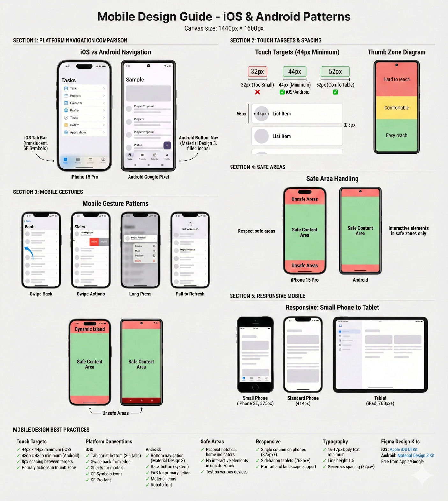

# R-68: Design for Mobile

# Recipe #68: Design for Mobile

Category: Bonus — Mobile  |  ⏱️ 35-40 min  |  🌶️🌶️🌶️ Advanced

<aside>
🎯

**USE WHEN:**

You're designing mobile apps or adapting your product for iOS and Android - understanding platform conventions, implementing mobile gestures, handling touch targets and safe areas, supporting different screen sizes, or creating platform-specific navigation patterns. Your current mobile designs feel generic, ignore platform conventions, have poor touch targets, or don't handle device variations properly.

</aside>

---

<aside>
⚠️

**THE CHALLENGE**

Many designers create poor mobile experiences - using desktop patterns on mobile (tiny buttons, hover states, complex navigation), ignoring platform conventions (same design for iOS and Android, missing platform-specific gestures), poor touch targets (buttons smaller than 44px, interactive elements too close), forgetting safe areas (content under notches, home indicators, or rounded corners), using wrong navigation patterns (hamburger menus instead of bottom navigation, non-native components), or designing one-size-fits-all (same layout for small phones and tablets, ignoring orientation). Teams build apps that feel foreign on both platforms, frustrate users who expect platform conventions, get rejected by app stores, or require expensive platform-specific redesigns. You need systematic mobile design - platform awareness (iOS tab bar vs Android bottom nav, native components, platform gestures), proper touch targets (44px minimum, adequate spacing), safe area handling (notches, home indicators, status bars, keyboards), mobile-specific patterns (sheets, swipe actions, pull-to-refresh), and responsive layouts (small phones to tablets, portrait/landscape, one-handed use).

</aside>

---

<aside>
📊

**WHAT TO EXPECT**

The AI will provide platform conventions (iOS tab bar vs Android bottom nav, native components, platform-specific gestures), touch target and spacing guidelines (44px minimum, thumb zones, one-handed reach), mobile gesture patterns (swipe, long-press, pull-to-refresh, platform-specific gestures), safe area handling (notches, home indicators, status bars, screen size variations), mobile navigation patterns (bottom navigation, hierarchical navigation, sheets), mobile-specific components (action sheets, swipe actions, FABs, pull-to-refresh), responsive mobile layouts (small phones to tablets, portrait/landscape, one-handed use), and mobile typography and spacing (16-17px body text minimum, generous spacing). You'll get systematic guidance to create native-feeling mobile experiences for both iOS and Android.

</aside>

---

<aside>
🧪

**THE PROMPT BLUEPRINT**

```jsx
Act as a Mobile Design Specialist focusing on iOS and Android platform conventions, mobile-specific patterns, touch interactions, and responsive mobile layouts.

I'm designing mobile interfaces for [App Type] targeting [Platforms] by understanding [Platform Conventions], implementing [Mobile Patterns], and optimizing for [Mobile Constraints].

[OPTIONAL: Attach current mobile designs or desktop designs needing mobile adaptation]

Mobile design requirements:
- Platforms: [e.g., iOS only, Android only, Both iOS and Android (cross-platform)]
- App type: [e.g., Social, Productivity, E-commerce, Content/media, Finance, Health/fitness]
- Target devices: [e.g., iPhone (all sizes), Android phones, Tablets, Both phones and tablets]
- Key screens: [e.g., Home/feed, Detail view, Settings, Profile, Content creation, Checkout]
- Navigation: [e.g., Bottom navigation, Tab bar, Drawer/hamburger, Modal navigation]

Current mobile design problems:
- [Problem 1: e.g., Desktop UI on mobile - tiny buttons, hover interactions, complex navigation doesn't work on touch]
- [Problem 2: e.g., Ignoring platform differences - same UI for iOS and Android, missing native patterns]
- [Problem 3: e.g., Small touch targets - 32px buttons, checkboxes too small, hard to tap accurately]
- [Problem 4: e.g., Content under safe areas - text hidden under notch, buttons behind home indicator]
- [Problem 5: e.g., Poor responsive design - same layout on small phones and tablets, wasted space or cramped]

Team context: [Mobile design experience, platform priorities, tools (Figma mobile kits), development (native or cross-platform)]

Please provide:
1. Platform conventions (iOS vs Android differences, tab bar vs bottom nav, navigation patterns, native components)
2. Touch targets and spacing (44px minimum, spacing between elements, thumb zones, one-handed reach)
3. Mobile gestures (swipe, tap, long-press, pinch, pull-to-refresh, platform-specific gestures)
4. Safe areas and screen variations (notches, Dynamic Island, home indicators, status bars, rounded corners, different sizes)
5. Mobile navigation patterns (bottom navigation, tab bar, drawer, sheets, hierarchical navigation)
6. Mobile-specific components (sheets, action sheets, pull-to-refresh, swipe actions, floating action buttons)
7. Responsive mobile layouts (small phones to tablets, portrait/landscape, one-handed use, split screen)
8. Mobile typography and spacing (readable text sizes, generous spacing, touch-friendly forms)

Consider: [Constraints - e.g., Cross-platform (iOS + Android), Small screens priority, One-handed use critical, Offline support needed]
```

💡 What to customize:

- [App Type] = Social, productivity, e-commerce, etc.
- [Platforms] = iOS, Android, or both
- [Platform Conventions] = Native patterns per platform
- [Mobile Patterns] = Gestures, navigation, components
- [Mobile Constraints] = Touch, safe areas, screen sizes
- [Problems 1-5] = Current mobile design issues
- Attach mobile designs or desktop → mobile adaptations
</aside>

---

<aside>
✨

**LIVE EXAMPLE**

```jsx
Act as a Mobile Design Specialist focusing on iOS and Android platform conventions, mobile-specific patterns, touch interactions, and responsive mobile layouts.

I'm designing mobile interfaces for a Task Management App (productivity app for personal and team tasks) targeting both iOS and Android (cross-platform, universal app) by understanding platform-specific navigation (iOS tab bar, Android bottom nav), implementing mobile gestures (swipe actions, pull-to-refresh, swipe back), and optimizing for small screens, touch interactions, safe areas, and one-handed use.

[User would attach current designs - desktop-first design needing mobile adaptation, or cross-platform designs ignoring platform differences]

Mobile design requirements:
- Platforms: Both iOS and Android (cross-platform app, must feel native on both)
- App type: Productivity (task management, lists, projects, collaboration)
- Target devices:
  - iPhone (iPhone SE to iPhone 16 Pro Max - small to large screens)
  - Android phones (various sizes, Samsung, Pixel, OnePlus)
  - Tablets: iPad and Android tablets (secondary, but must support)
- Key screens:
  - Home: Task list with filters and search
  - Task detail: View/edit task with subtasks, attachments, comments
  - Projects: Project list and kanban board view
  - Settings: App preferences and account settings
  - Create task: Quick task creation (modal/sheet)
- Navigation:
  - iPhone: Tab bar navigation (4 tabs: Tasks, Projects, Calendar, Profile)
  - Android: Bottom navigation (same 4 sections, Material Design 3 style)
  - Hierarchical: Drill-down navigation within each section

Current mobile design problems:
- Desktop UI ported to mobile - Buttons 32px (too small for touch), hover states that don't work on mobile, complex navigation with dropdowns (hard on touch), multi-column layouts cramped on small screens, 14px body text (too small for mobile reading), designed for mouse not fingers
- Ignoring platform differences - Same exact UI for iOS and Android (no platform-specific navigation), using iOS tab bar on Android (should be Material bottom nav), no platform-specific components (sheets vs bottom sheets, action sheets vs dialogs), missing platform gestures (no swipe back on iOS, no FAB on Android where expected)
- Small touch targets - Buttons 32px × 32px (below 44px minimum), checkboxes 16px (can't tap accurately), list items 48px tall with actions close together (mis-taps common), "X" close buttons 24px × 24px (frustrating to tap)
- Content under safe areas - Text hidden under iPhone notch/Dynamic Island, buttons partially behind home indicator area (bottom 34px), content doesn't respect rounded screen corners, status bar overlaps header text, keyboard covers input fields without scrolling
- Poor responsive design - Same layout on iPhone SE (small 4.7" screen) and iPhone 16 Pro Max (large 6.9" screen), wasted space on large phones, cramped on small phones, no adaptation for tablets (phone UI stretched to 10" screen looks ridiculous), no landscape orientation support, portrait-only design

Team context:
- Mobile experience: Limited (team designed desktop-first web app, now building mobile)
- Platform priorities: Equal (50% iOS users, 50% Android users, can't favor one platform)
- Tools: Figma with iOS and Material Design kits (available but not using them properly)
- Development: React Native (cross-platform, can use native components for each platform)
- Timeline: 8 weeks to design and ship mobile apps (tight deadline)
- User feedback: Beta testers say "doesn't feel like a real mobile app", "hard to use one-handed", "buttons too small"

Please provide:
1. Platform conventions (iOS vs Android differences, tab bar vs bottom nav, navigation patterns, native components)
2. Touch targets and spacing (44px minimum, spacing between elements, thumb zones, one-handed reach)
3. Mobile gestures (swipe, tap, long-press, pinch, pull-to-refresh, platform-specific gestures)
4. Safe areas and screen variations (notches, Dynamic Island, home indicators, status bars, rounded corners, different sizes)
5. Mobile navigation patterns (bottom navigation, tab bar, drawer, sheets, hierarchical navigation)
6. Mobile-specific components (sheets, action sheets, pull-to-refresh, swipe actions, floating action buttons)
7. Responsive mobile layouts (small phones to tablets, portrait/landscape, one-handed use, split screen)
8. Mobile typography and spacing (readable text sizes, generous spacing, touch-friendly forms)

Consider: Cross-platform (must feel native on iOS AND Android). Small screens (iPhone SE, small Android phones). Touch targets 44px minimum. Safe areas (notches, home indicators). One-handed use (thumb zones). Tab bar (iOS) vs Bottom nav (Android). React Native implementation. Equal platform priority.
```

</aside>

---

<aside>
👩‍🍳

**CHEF'S TIPS**

✦ Touch targets matter: 44px minimum - smaller buttons frustrate users and cause mis-taps
✦ Common mistake: Using same design for iOS and Android - create platform-specific navigation (tab bar vs bottom nav)
✦ Best with: Claude (excellent at platform conventions, systematic mobile patterns), ChatGPT (good for gesture explanations)
✦ Remix it: "Adapt this desktop design for mobile - 44px touch targets, bottom navigation, safe areas, one-handed use"
✦ Pro move: Ask "Audit my mobile design - check touch targets, platform conventions, safe areas, responsive layouts"

</aside>

---

<aside>
🎯

**FOLLOW-UP PROMPTS**

- "Design mobile task list for iOS and Android - platform-specific navigation, swipe actions, pull-to-refresh, safe areas"
- "Create mobile navigation - iOS tab bar (4 tabs) and Android bottom nav (Material Design 3), with icons and labels"
- "Adapt desktop form for mobile - 44px touch targets, mobile keyboard optimization, safe area handling, one-handed use"
- "Design responsive mobile layout - small phones (375px) to tablets (768px+), portrait and landscape support"
</aside>

---

<aside>
💎

**EXAMPLE OUTPUT**



</aside>

---

<aside>
🔗

**RELATED RECIPES**
→ Recipe #51: [Build Responsive Components](R-51%20Build%20Responsive%20Components%202d767ccc6bef8015b2effc042a7b2cbe.md)
→ Recipe #52: [Design Multi-State Components](R-52%20Design%20Multi-State%20Components%202d767ccc6bef80c091a9e89c40b1fd3a.md)
→ Recipe #15: [Design Better Forms](R-15%20Design%20Better%20Forms%202d667ccc6bef80a58694ce629bd1838e.md)

</aside>